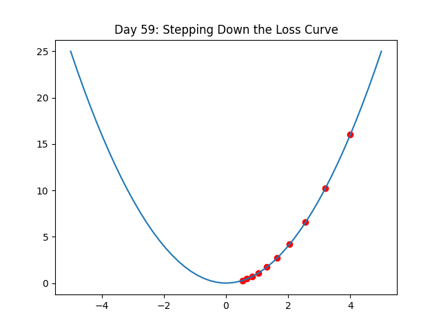

# 120 Days of Machine Learning: From Foundations to MLOps 🚀

This repository documents my 120-day journey of mastering Machine Learning, from data preprocessing to deploying production-grade models.

## 🗺️ Progress Roadmap

| Phase | Focus | Status |
| :--- | :--- | :--- |
| **01** | **Foundations (Math, Stats & Preprocessing)** | ✅ **Completed** |
| **02** | **Supervised Learning (Regression & Classification)** | ✅ **Completed** |
| **03** | **Unsupervised Learning (Clustering & Rules)** | ✅ **Completed** |
| **04** | **Deep Learning (Neural Networks, CV & NLP)** | 🏗️ **Active (Day 62/120)** |

---

## 📈 Phase 4 Log: Deep Learning Foundations

Moving from simple math neurons to multi-layer architectures and optimization theory.

### **The Mechanics of Learning**
* **Day 59: Gradient Descent**
  - Implemented the "Step-down" logic to minimize loss functions.
  - *Key Concept: Learning Rate & Gradients.*
  

* **Day 60: Loss Functions**
  - Explored **MSE** for regression and **Binary Cross-Entropy** for classification.
  - Learned how the model "penalizes" itself for being wrong.

* **Day 61: The Bias-Variance Tradeoff**
  - Visualized why a model that "memorizes" noise (Overfitting) fails on real-world data.
  

* **Day 62: Model Discipline (Regularization)**
  - Applied **Dropout** to randomly deactivate neurons, forcing the network to learn robust features.
  - Implemented **L2 Regularization** to prevent weight explosion.

---

## 📂 Repository Structure

```text
├── 04_DeepLearning/
│   └── 01_Foundations/         
│       ├── day59_gradient_descent.ipynb
│       ├── day60_loss_functions.ipynb
│       ├── day61_overfitting.ipynb
│       └── day62_regularization.ipynb
├── assets/                     # Visual Gallery of Learning
└── requirements.txt            # Project dependencies (TensorFlow 2.21.0+)

```
## 🛠️ Tech Stack
* **Language:** Python 3.10+
* **Libraries:** NumPy, Pandas, Matplotlib, Seaborn, Scipy
* **Environment:** VS Code, Jupyter Notebooks, Git

## ⚙️ Setup Instructions
```
### 1. Activate Virtual Environment
Depending on your operating system, run the following in your terminal:
```
**Windows:**
```bash
ml_env\Scripts\activate
```
### 2. Mac/Linux Activation
If you are on a Unix-based system, use the following command:
```bash
source ml_env/bin/activate
```
### 3. Install Dependencies
Ensure you have the latest versions of the required libraries by running:
```bash
pip install -r requirements.txt
