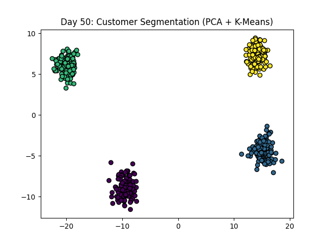
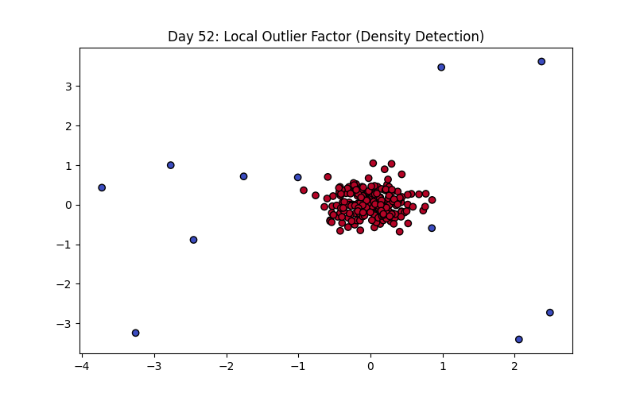

# 120 Days of Machine Learning: From Foundations to MLOps 🚀

This repository documents my 120-day journey of mastering Machine Learning, from data preprocessing to deploying production-grade models.

## 🗺️ Progress Roadmap

| Phase | Focus | Status |
| :--- | :--- | :--- |
| **01** | **Foundations (Math, Stats & Preprocessing)** | ✅ **Completed** |
| **02** | **Supervised Learning (Regression & Classification)** | ✅ **Completed** |
| **03** | **Unsupervised Learning (Clustering & Rules)** | 🏗️ **Active (Day 54/120)** |

---

## 📈 Phase 3 Log: Unsupervised Learning

### **Clustering & Dimensionality**
* **Day 41-44:** Explored **K-Means**, **Hierarchical**, and **DBSCAN**.
* **Day 45-47:** Mastered **PCA** and **t-SNE** for high-dimensional data visualization.
* **Day 48-49:** Implemented **Apriori** and **ECLAT** for Market Basket Analysis.

### **Advanced Unsupervised Applications**

**Day 50: Mid-Phase Capstone (Customer Segmentation)**
* **Reflection:** Combined PCA and K-Means to segment 500 customers into distinct behavioral personas. Reducing dimensions before clustering created much sharper, more actionable segments.


**Day 51-52: Anomaly & Fraud Detection**
* **Isolation Forest:** Learned to isolate anomalies by randomly partitioning data—outliers are easier to isolate (fewer splits).
* **Local Outlier Factor (LOF):** Implemented density-based detection to find points that are "lonely" relative to their local neighborhood.


**Day 53-54: Recommendation Systems**
* **Content-Based Filtering:** Built a system to recommend items based on feature similarity (tags/genres) using **Cosine Similarity**.
* **Collaborative Filtering:** Explored user-user similarity by calculating correlation between rating patterns ("Users like you also liked...").

---

## 📂 Repository Structure

```text
├── 03_Unsupervised/
│   ├── 01_Clustering/          # Days 41-44
│   ├── 02_Dimensionality/      # Days 45-47
│   ├── 03_Association/         # Days 48-49
│   ├── 04_Projects/            # Day 50 (Segmentation Project)
│   ├── 05_Anomalies/           # Days 51-52 (Outlier Detection)
│   └── 06_Recommendations/     # Days 53-54 (Rec Engines)
├── assets/                     # Model Visualizations
└── requirements.txt            # Project dependencies

## 🛠️ Tech Stack
* **Language:** Python 3.10+
* **Libraries:** NumPy, Pandas, Matplotlib, Seaborn, Scipy
* **Environment:** VS Code, Jupyter Notebooks, Git

## ⚙️ Setup Instructions
```
### 1. Activate Virtual Environment
Depending on your operating system, run the following in your terminal:
```
**Windows:**
```bash
ml_env\Scripts\activate
```
### 2. Mac/Linux Activation
If you are on a Unix-based system, use the following command:
```bash
source ml_env/bin/activate
```
### 3. Install Dependencies
Ensure you have the latest versions of the required libraries by running:
```bash
pip install -r requirements.txt
