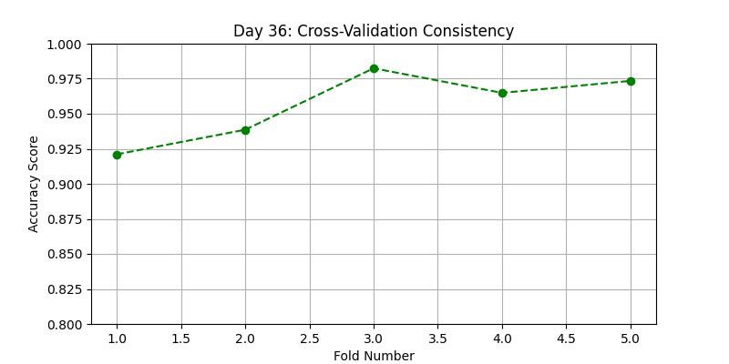

# 120 Days of Machine Learning: From Foundations to MLOps 🚀

This repository documents my 120-day journey from Python data science foundations to production-grade Machine Learning Engineering.

## 🗺️ The Roadmap

| Phase | Focus | Status |
| :--- | :--- | :--- |
| **01** | **Foundations (Math, Stats & Preprocessing)** | ✅ **Completed** |
| **02** | **Supervised Learning (Regression & Classification)** | 🏗️ **Active** |
| **03** | **Unsupervised Learning (Clustering/PCA)** | ⏳ Pending |
| **04** | **Deep Learning (PyTorch/CNN/NLP)** | ⏳ Pending |
| **05** | **MLOps & Deployment (FastAPI/Docker)** | ⏳ Pending |

---

## 📈 Daily Progress Log (Phase 2 Continued)

### **Week 2: Advanced Classification**
* **Day 29:** Support Vector Machines (SVM) - Maximizing the margin between classes.
* **Day 30:** Naive Bayes - Probabilistic classification using Bayes' Theorem.

### **Week 3: Tree-Based Models & Ensembles**
* **Day 31:** Decision Trees - Logic-based splitting using Gini Impurity.
* **Day 32:** Random Forest - Bagging ensemble to reduce variance.

### **Week 4: Boosting & Model Validation**

**Day 33: AdaBoost (Adaptive Boosting)**
* **File:** `02_Supervised/day33_adaboost.ipynb`
* **Reflection:** Learned how models can be built sequentially. AdaBoost focuses on the "hard" cases by increasing the weights of misclassified points from the previous round.


**Day 34: Gradient Boosting (GBM)**
* **File:** `02_Supervised/day34_gbm.ipynb`
* **Reflection:** Understood how Gradient Descent is applied to ensembles. Instead of weights, GBM trains new trees to predict the *residuals* (errors) of the previous trees.


**Day 35: XGBoost (Extreme Gradient Boosting)**
* **File:** `02_Supervised/day35_xgboost.ipynb`
* **Reflection:** Implemented the industry standard for tabular data. XGBoost is faster and more robust due to its built-in regularization and efficient handling of sparse data.

**Day 36: K-Fold Cross-Validation**
* **File:** `02_Supervised/day36_cross_validation.ipynb`
* **Reflection:** Moved beyond the simple train-test split. By testing the model on 5 different folds, I can now mathematically prove the stability and reliability of my classifiers.



---

## 📂 Repository Structure

```text
├── 01_Foundations/             # Phase 1: Completed ✅
├── 02_Supervised/              # Phase 2: Active 🏗️
│   ├── ...
│   ├── day32_random_forest.ipynb
│   ├── day33_adaboost.ipynb
│   ├── day34_gbm.ipynb
│   ├── day35_xgboost.ipynb
│   └── day36_cross_validation.ipynb
├── assets/                     # Professional Plots
│   ├── day21_plot.png
│   ├── ...
│   ├── day29_plot.png
│   └── day36_plot.png
├── data/                       # Datasets used in projects
├── .gitignore                  # Git ignore rules
└── requirements.txt            # Project dependencies

## 🛠️ Tech Stack
* **Language:** Python 3.10+
* **Libraries:** NumPy, Pandas, Matplotlib, Seaborn, Scipy
* **Environment:** VS Code, Jupyter Notebooks, Git

## ⚙️ Setup Instructions
```
### 1. Activate Virtual Environment
Depending on your operating system, run the following in your terminal:
```
**Windows:**
```bash
ml_env\Scripts\activate
```
### 2. Mac/Linux Activation
If you are on a Unix-based system, use the following command:
```bash
source ml_env/bin/activate
```
### 3. Install Dependencies
Ensure you have the latest versions of the required libraries by running:
```bash
pip install -r requirements.txt
