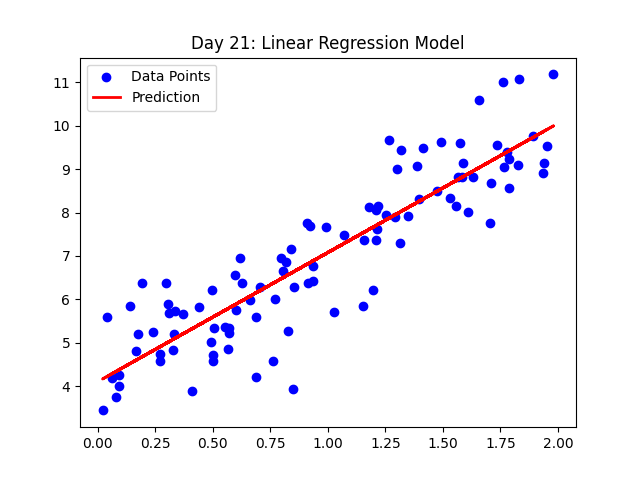
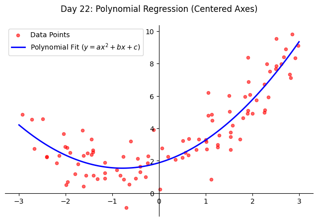
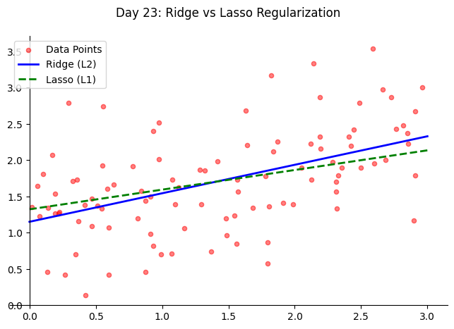
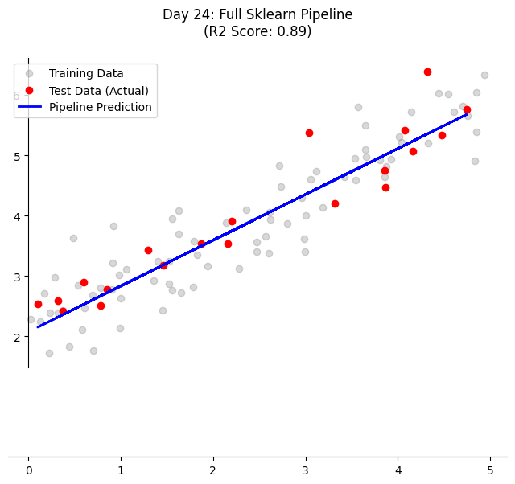
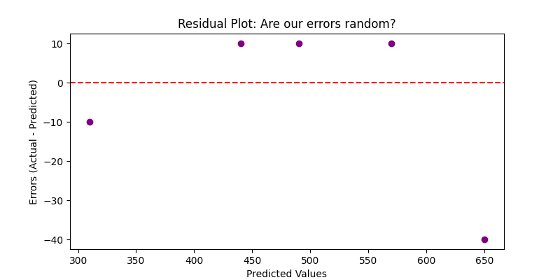

# 120 Days of Machine Learning: From Foundations to MLOps 🚀

This repository documents my 120-day journey from Python data science foundations to production-grade Machine Learning Engineering.

## 🗺️ The Roadmap

| Phase | Focus | Status |
| :--- | :--- | :--- |
| **01** | **Foundations (Math, Stats & Preprocessing)** | ✅ **Completed** |
| **02** | **Supervised Learning (Regression/Trees)** | 🏗️ **Active** |
| **03** | **Unsupervised Learning (Clustering/PCA)** | ⏳ Pending |
| **04** | **Deep Learning (PyTorch/CNN/NLP)** | ⏳ Pending |
| **05** | **MLOps & Deployment (FastAPI/Docker)** | ⏳ Pending |
| **06** | **Interview Prep & System Design** | ⏳ Pending |

---

## 📈 Daily Progress Log

### 📂 Phase 1: Foundations (Days 1–20)

**Day 01 - Day 14: Core Math & Statistics**
* (Previous entries retained: NumPy, Pandas, EDA, Linear Algebra, Calculus, Matrix Inversion, Tensors, Probability, and Hypothesis Testing.)

**Day 15: Sampling Techniques**
* **File:** `01_Foundations/day15_sampling.ipynb`
* **Concepts:** Train-Test Split and Stratified Sampling.
* **Reflection:** Learned how to properly partition data to ensure the model generalizes well. Stratification is key for maintaining class balance.

**Day 16: Handling Imbalanced Data**
* **File:** `01_Foundations/day16_imbalanced_data.ipynb`
* **Concepts:** Random Over-sampling and SMOTE (Synthetic Minority Over-sampling Technique).
* **Reflection:** Mastered techniques to fix "biased" datasets. SMOTE is powerful because it creates synthetic data points rather than just duplicating existing ones.

**Day 17: Feature Scaling (Standardization vs. Normalization)**
* **File:** `01_Foundations/day17_scaling.ipynb`
* **Concepts:** StandardScaler ($Z$-score) and MinMaxScaler (0-1 range).
* **Reflection:** Understood that distance-based models (like KNN or SVM) fail without scaling because large-magnitude features dominate the distance calculation.

**Day 18: Categorical Encoding**
* **File:** `01_Foundations/day18_encoding.ipynb`
* **Concepts:** One-Hot Encoding (Nominal) and Label Encoding (Ordinal).
* **Reflection:** Learned to convert text to math. One-hot is great for unordered categories (Colors), while Label encoding preserves rank (Small, Medium, Large).

**Day 19: Handling Missing Values (Imputation)**
* **File:** `01_Foundations/day19_imputation.ipynb`
* **Concepts:** SimpleImputer (Mean/Median/Mode strategy).
* **Reflection:** Dropping data is a last resort. Imputation allows us to keep the dataset size intact by filling holes with statistical averages.

**Day 20: Feature Selection & Correlation**
* **File:** `01_Foundations/day20_feature_selection.ipynb`
* **Concepts:** Correlation Heatmaps and Feature Redundancy.
* **Reflection:** Finished the Foundations phase! Learned that removing highly correlated features reduces model complexity and prevents "multicollinearity" issues.

### 📂 Phase 2: Supervised Learning (Days 21–40)

**Day 21: Linear Regression from Scratch**
* **File:** `02_Supervised/day21_linear_regression.ipynb`
* **Concepts:** Normal Equation, Slope ($m$), and Intercept ($c$).
* **Reflection:** Implementing the math from scratch with centered axes helped visualize how the model minimizes the distance between the data and the line.


**Day 22: Polynomial Regression**
* **File:** `02_Supervised/day22_poly_regression.ipynb`
* **Concepts:** PolynomialFeatures, Quadratic fitting ($y = ax^2 + bx + c$).
* **Reflection:** Learned that non-linear patterns can still be solved using linear algorithms if we transform the feature space first.


**Day 23: Regularization (Ridge & Lasso)**
* **File:** `02_Supervised/day23_regularization.ipynb`
* **Concepts:** L1 (Lasso) vs L2 (Ridge) penalties, alpha tuning.
* **Reflection:** Lasso is a game-changer for feature selection as it can push unimportant coefficients to zero, effectively simplifying the model automatically.


**Day 24: Scikit-Learn Pipeline**
* **File:** `02_Supervised/day24_sklearn_pipeline.ipynb`
* **Concepts:** `train_test_split`, model validation, and predictive workflows.
* **Reflection:** Standardizing the workflow ensures that evaluation is done on unseen data, preventing "data leakage" and over-optimistic results.


**Day 25: Regression Evaluation Metrics**
* **File:** `02_Supervised/day25_metrics.ipynb`
* **Concepts:** MSE, RMSE, MAE, and $R^2$ Score.
* **Reflection:** RMSE is usually preferred for business cases because it is in the same units as the target, making the error easier to explain to non-technical stakeholders.


---

├── 01_Foundations/             # Phase 1: Completed ✅
├── 02_Supervised/              # Phase 2: Active 🏗️
│   ├── day21_linear_regression.ipynb
│   ├── day22_poly_regression.ipynb
│   ├── day23_regularization.ipynb
│   ├── day24_sklearn_pipeline.ipynb
│   └── day25_metrics.ipynb
├── assets/                     # Professional Plots (Textbook Style)
│   ├── day21_plot.png
│   ├── day22_plot.png
│   ├── day23_plot.png
│   ├── day24_plot.png
│   └── day25_plot.png
├── data/                       
├── .gitignore                  
└── requirements.txt


## 🛠️ Tech Stack
* **Language:** Python 3.10+
* **Libraries:** NumPy, Pandas, Matplotlib, Seaborn, Scipy
* **Environment:** VS Code, Jupyter Notebooks, Git

## ⚙️ Setup Instructions
```
### 1. Activate Virtual Environment
Depending on your operating system, run the following in your terminal:
```
**Windows:**
```bash
ml_env\Scripts\activate
```
### 2. Mac/Linux Activation
If you are on a Unix-based system, use the following command:
```bash
source ml_env/bin/activate
```
### 3. Install Dependencies
Ensure you have the latest versions of the required libraries by running:
```bash
pip install -r requirements.txt
