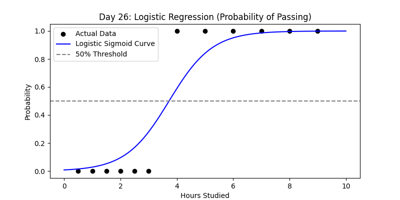
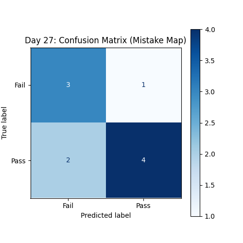
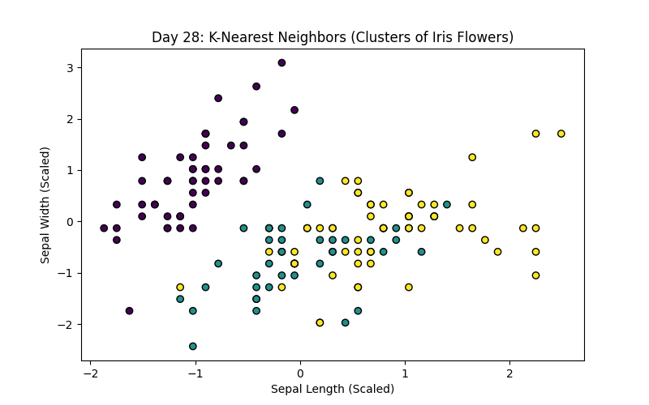

# 120 Days of Machine Learning: From Foundations to MLOps 🚀

This repository documents my 120-day journey from Python data science foundations to production-grade Machine Learning Engineering.

## 🗺️ The Roadmap

| Phase | Focus | Status |
| :--- | :--- | :--- |
| **01** | **Foundations (Math, Stats & Preprocessing)** | ✅ **Completed** |
| **02** | **Supervised Learning (Regression & Classification)** | 🏗️ **Active** |
| **03** | **Unsupervised Learning (Clustering/PCA)** | ⏳ Pending |
| **04** | **Deep Learning (PyTorch/CNN/NLP)** | ⏳ Pending |
| **05** | **MLOps & Deployment (FastAPI/Docker)** | ⏳ Pending |
| **06** | **Interview Prep & System Design** | ⏳ Pending |

---

## 📈 Daily Progress Log

### 📂 Phase 1: Foundations (Days 1–20) ✅
*Focus: Mastering NumPy, Pandas, Statistics, and Data Cleaning.*
(Detailed logs for Days 01-20 are archived in the repository history.)

---

### 📂 Phase 2: Supervised Learning (Days 21–40) 🏗️

#### **Week 1: Regression (Predicting Numbers)**

**Day 21: Linear Regression from Scratch**
* **File:** `02_Supervised/day21_linear_regression.ipynb`
* **Concepts:** Normal Equation, Slope ($m$), and Intercept ($c$).
* **Reflection:** Implementing math from scratch helped visualize how the model minimizes the distance between data and the line.


**Day 22: Polynomial Regression**
* **File:** `02_Supervised/day22_poly_regression.ipynb`
* **Concepts:** PolynomialFeatures, Quadratic fitting ($y = ax^2 + bx + c$).
* **Reflection:** Learned that non-linear patterns can be solved by transforming the feature space into higher degrees.


**Day 23: Regularization (Ridge & Lasso)**
* **File:** `02_Supervised/day23_regularization.ipynb`
* **Concepts:** L1 (Lasso) vs L2 (Ridge) penalties.
* **Reflection:** Lasso is a powerful tool for feature selection as it can push unimportant coefficients to exactly zero.


**Day 24: Scikit-Learn Regression Workflow**
* **File:** `02_Supervised/day24_sklearn_regression.ipynb`
* **Concepts:** `train_test_split`, Model Validation, and Predictive Workflows.
* **Reflection:** Standardizing the workflow prevents "data leakage" and ensures the model is tested on truly unseen data.


**Day 25: Regression Evaluation Metrics**
* **File:** `02_Supervised/day25_metrics.ipynb`
* **Concepts:** MSE, RMSE, MAE, and $R^2$ Score.
* **Reflection:** $R^2$ tells us the percentage of variance the model explains, while RMSE gives us the error in original units (e.g., dollars).


#### **Week 2: Classification (Predicting Categories)**

**Day 26: Logistic Regression**
* **File:** `02_Supervised/day26_logistic_regression.ipynb`
* **Concepts:** Sigmoid Function, Binary Classification, and Probabilities.
* **Reflection:** Despite the name, this is for classification. It squeezes outputs between 0 and 1 to represent the probability of a class.



**Day 27: Classification Metrics**
* **File:** `02_Supervised/day27_classification_metrics.ipynb`
* **Concepts:** Confusion Matrix, Precision, Recall, and F1-Score.
* **Reflection:** Accuracy isn't everything. In medicine, a False Negative (missing a disease) is much more costly than a False Positive.



**Day 28: K-Nearest Neighbors (KNN)**
* **File:** `02_Supervised/day28_knn.ipynb`
* **Concepts:** Euclidean Distance, $K$-value selection, and Feature Scaling.
* **Reflection:** KNN is a "lazy learner." Because it relies on distance, **Feature Scaling is mandatory**; otherwise, features with larger units will dominate the prediction.



---

## 📂 Repository Structure

```text
├── 01_Foundations/             # Phase 1: Completed ✅
├── 02_Supervised/              # Phase 2: Active 🏗️
│   ├── day21_linear_regression.ipynb
│   ├── day22_poly_regression.ipynb
│   ├── day23_regularization.ipynb
│   ├── day24_sklearn_regression.ipynb
│   ├── day25_metrics.ipynb
│   ├── day26_logistic_regression.ipynb
│   ├── day27_classification_metrics.ipynb
│   └── day28_knn.ipynb
├── assets/                     # Professional Plots (Textbook Style)
│   ├── day21_plot.png
│   ├── ...
│   └── day28_plot.png
├── data/                       # Datasets used in projects
├── .gitignore                  # Git ignore rules
└── requirements.txt            # Project dependencies


## 🛠️ Tech Stack
* **Language:** Python 3.10+
* **Libraries:** NumPy, Pandas, Matplotlib, Seaborn, Scipy
* **Environment:** VS Code, Jupyter Notebooks, Git

## ⚙️ Setup Instructions
```
### 1. Activate Virtual Environment
Depending on your operating system, run the following in your terminal:
```
**Windows:**
```bash
ml_env\Scripts\activate
```
### 2. Mac/Linux Activation
If you are on a Unix-based system, use the following command:
```bash
source ml_env/bin/activate
```
### 3. Install Dependencies
Ensure you have the latest versions of the required libraries by running:
```bash
pip install -r requirements.txt
