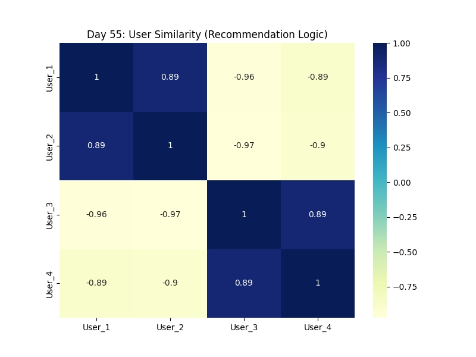
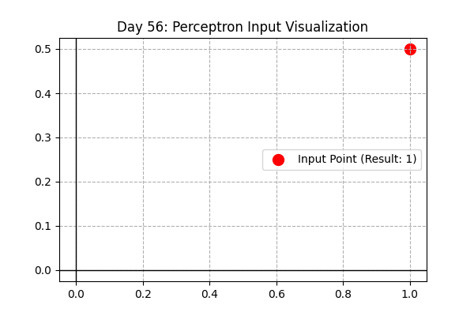
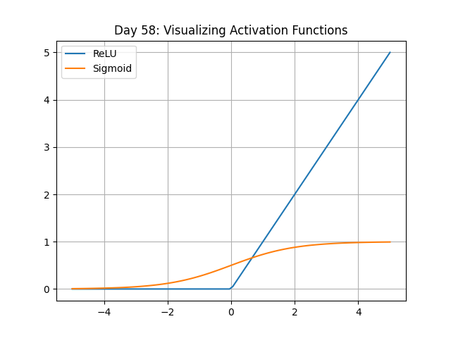

# 120 Days of Machine Learning: From Foundations to MLOps 🚀

This repository documents my 120-day journey of mastering Machine Learning, from data preprocessing to deploying production-grade models.

## 🗺️ Progress Roadmap

| Phase | Focus | Status |
| :--- | :--- | :--- |
| **01** | **Foundations (Math, Stats & Preprocessing)** | ✅ **Completed** |
| **02** | **Supervised Learning (Regression & Classification)** | ✅ **Completed** |
| **03** | **Unsupervised Learning (Clustering & Rules)** | ✅ **Completed** |
| **04** | **Deep Learning (Neural Networks, CV & NLP)** | 🏗️ **Active (Day 58/120)** |

---

## 📈 Phase 3 Log: Unsupervised Learning (Finalized)

### **Advanced Applications**
* **Day 50:** **Customer Segmentation Capstone** - Used PCA + K-Means to identify 4 distinct user personas.
* **Day 51-52:** **Anomaly Detection** - Implemented Isolation Forest and LOF for fraud/outlier detection.
* **Day 53-55:** **Recommendation Engines** - Built a similarity-based engine. 

**Highlight: User Similarity Heatmap (Day 55)**
Using Cosine Similarity to find "taste-twins" among users.


---

## 🧠 Phase 4 Log: Deep Learning Foundations

Starting the journey into Neural Networks. Moving from simple math neurons to multi-layer architectures.

### **Foundations**
* **Day 56: The Perceptron**
  - Built the "Atom" of AI. Learned how weights and biases form a simple decision boundary.
  

* **Day 57: First Neural Network (Keras)**
  - Developed a Sequential model in TensorFlow to solve the XOR logic problem. 
  - *Keywords: Layers, Neurons, Loss Functions, Optimizers.*

* **Day 58: Activation Functions**
  - Visualized why non-linearity is essential for deep learning.
  - Compared **ReLU** (standard for hidden layers) vs. **Sigmoid** (output probability).
  

---

## 📂 Repository Structure

```text
├── 03_Unsupervised/
│   ├── 04_Projects/            # Day 50 (Segmentation)
│   ├── 05_Anomalies/           # Days 51-52 (Isolation Forest, LOF)
│   └── 06_Recommendations/     # Days 53-55 (Rec Engines)
├── 04_DeepLearning/
│   └── 01_Foundations/         # Days 56-58 (Perceptron, Keras, Activations)
├── assets/                     # Model Visualizations & Plots
└── requirements.txt            # Project dependencies

```
## 🛠️ Tech Stack
* **Language:** Python 3.10+
* **Libraries:** NumPy, Pandas, Matplotlib, Seaborn, Scipy
* **Environment:** VS Code, Jupyter Notebooks, Git

## ⚙️ Setup Instructions
```
### 1. Activate Virtual Environment
Depending on your operating system, run the following in your terminal:
```
**Windows:**
```bash
ml_env\Scripts\activate
```
### 2. Mac/Linux Activation
If you are on a Unix-based system, use the following command:
```bash
source ml_env/bin/activate
```
### 3. Install Dependencies
Ensure you have the latest versions of the required libraries by running:
```bash
pip install -r requirements.txt
